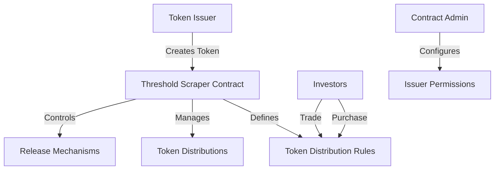

# Threshold Scraper

A cutting-edge smart contract platform for dynamic token distribution with threshold-based mechanisms on the Stacks blockchain. Threshold Scraper enables organizations to create sophisticated token allocation strategies with precise control over distribution, release, and investment parameters.

## Overview

Threshold Scraper revolutionizes digital asset management by introducing flexible, programmable token distribution:

- **Dynamic Token Allocation**: Granular control over token release mechanisms
- **Configurable Distribution Parameters**: Thresholds, rates, and release schedules
- **Secure Trading Infrastructure**: Primary and secondary market capabilities
- **Automated Distribution**: Scheduled token releases and claims
- **Transparent Tracking**: Immutable record of token ownership and distribution history

## Architecture

The platform leverages a smart contract designed for complex token management:



### Core Components:
- Token Issuance Management
- Investor Holdings Registry
- Threshold-Based Distribution System
- Trading Infrastructure
- Maturity and Release Handling

## Contract Documentation

### Core Functions

#### Token Issuance
- `create-token`: Creates a new token with distribution parameters
- `add-token-issuer`: Authorizes an issuer (admin only)
- `remove-token-issuer`: Removes issuer authorization

#### Investment Operations
- `purchase-tokens`: Buy tokens in primary market
- `transfer`: Trade tokens in secondary market
- `get-balance`: Check token holdings

#### Distribution Operations
- `fund-token-distributions`: Issuer funds token distributions
- `claim-distribution`: Token holders claim distributions
- `early-release`: Optional early token release if permitted

### Access Control
- Contract Owner: Manages issuer authorizations
- Token Issuers: Create and manage tokens
- Investors: Purchase, trade, and claim tokens

## Getting Started

### Prerequisites
- Clarinet
- Stacks Wallet
- STX tokens for transactions

### Usage Examples

1. Creating a Token
```clarity
(contract-call? .threshold-token create-token
    u1000000000 ;; total supply
    u10000      ;; distribution threshold
    u500        ;; 5% distribution rate
    u144        ;; release frequency (blocks)
    u52560      ;; maturity (~ 1 year)
    false       ;; early release not allowed
)
```

2. Purchasing Tokens
```clarity
(contract-call? .threshold-token purchase-tokens
    u1          ;; token ID
    u5          ;; units to purchase
    none        ;; recipient (optional)
)
```

3. Claiming Distribution
```clarity
(contract-call? .threshold-token claim-distribution u1)
```

## Development

### Testing
1. Clone the repository
2. Install Clarinet
3. Run tests:
```bash
clarinet test
```

### Local Development
1. Start Clarinet console:
```bash
clarinet console
```
2. Deploy contract:
```clarity
(contract-call? .threshold-token ...)
```

## Security Considerations

### Key Safety Measures
- Strict access control for administrative functions
- Comprehensive input validation
- Balance checks before token transfers
- Configurable maturity and release mechanisms

### Limitations
- Distribution rates fixed at token creation
- No dynamic rate adjustments
- Early release must be pre-configured
- Operations limited to STX token ecosystem

### Best Practices
- Thoroughly review token distribution parameters
- Monitor token release schedules
- Maintain sufficient STX balance
- Understand token terms before investing